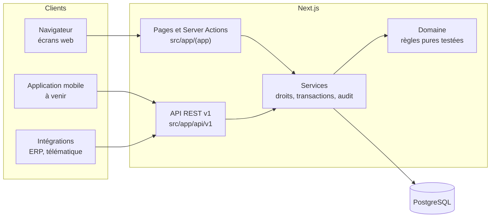
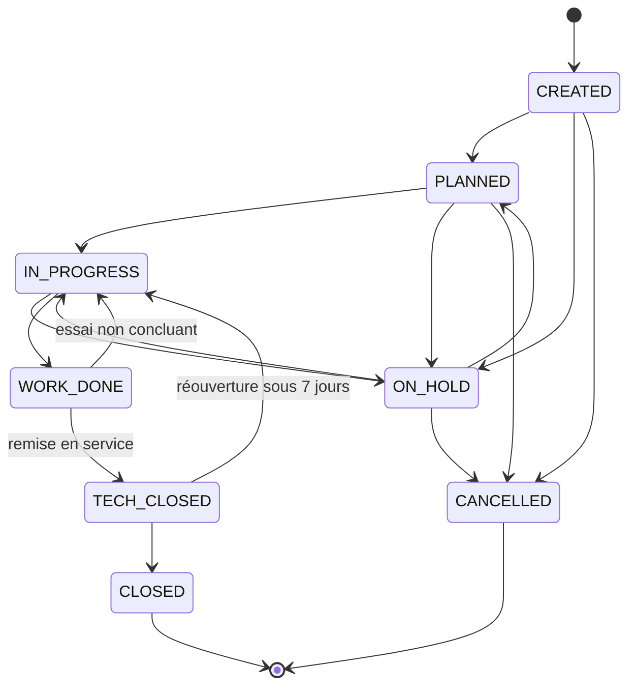

# Architecture

Ce document décrit l'organisation du code, le modèle de données et les règles transverses. Le besoin fonctionnel est dans `cahier-des-charges.md`, l'avancement exigence par exigence dans `tracabilite.md`.

## Vue d'ensemble

- **Une seule porte d'entrée métier** : les écrans (Server Actions) et l'API appellent les mêmes fonctions de `src/server/services/`. Les droits, les règles et l'audit sont donc identiques quel que soit le canal (TEC-09). Le canal est tracé dans le journal (`WEB`, `API`, `MOBILE`, `IMPORT`, `SYSTEM`).
- **Domaine pur** : `src/server/domain/` ne connaît ni la base ni Next.js. On y trouve la machine à états des OT, le calcul des échéances préventives, les contrôles de relevés, les règles de stock et les indicateurs. Ces modules sont couverts par les tests Vitest.
- **Services** : chaque cas d'usage reçoit un `AuthContext`, valide l'entrée (Zod), vérifie le droit sur la cible (société, site), s'exécute dans une transaction et écrit l'audit dans la même transaction.

## Authentification et autorisation

- **Authentification** (Better Auth) : courriel et mot de passe, sans inscription libre ; SSO Microsoft Entra ID activé par configuration, sans création implicite de compte ; jetons Bearer pour le mobile et les intégrations. Un compte désactivé ne peut plus ouvrir de session et ses sessions sont fermées (HAB-08).
- **Autorisation** : un utilisateur cumule des affectations **rôle × périmètre** (groupe, société ou site), éventuellement bornées dans le temps (délégation, HAB-03). `buildAuthContext` en déduit, pour chaque droit, le périmètre effectif : tout le groupe, ou une liste de sociétés et de sites.
  - `ctx.can(droit)` : le droit est-il détenu quelque part ?
  - `ctx.canOn(droit, { companyId, siteId })` : sur cette cible ?
  - `scopeWhere(ctx.scope(droit), colonneSociété, colonneSite)` : condition SQL appliquée à toutes les listes, recherches et API (HAB-02).
- Un objet hors périmètre répond « introuvable » (404) : son existence n'est pas révélée.
- La matrice rôle → droits est dans `src/server/authz/permissions.ts` (31 droits, 10 rôles).

| Rôle | Principaux droits |
| --- | --- |
| Administrateur | Paramétrage, utilisateurs, référentiels, lecture de tout |
| Responsable maintenance | Plans, OT (gestion, exécution, remise en service), validation d'inventaire, audit, indicateurs |
| Gestionnaire de flotte | Équipements, affectations, compteurs et corrections, qualification des DI |
| Chef d'atelier | Qualification des DI, gestion et exécution des OT, remise en service, planning |
| Technicien | Exécution des OT qui lui sont affectés, relevés, DI, mouvements de stock |
| Conducteur / opérateur | DI et relevés sur son périmètre |
| Magasinier | Articles, mouvements, inventaire |
| Responsable achats | Articles, fournisseurs |
| Direction | Lecture et indicateurs |
| Prestataire externe | Exécution des OT qui lui sont confiés |

## Modèle de données

Toutes les tables métier portent `tenant_id` (isolation des clients, TEC-02) ; les objets rattachés à une société ou un site portent aussi `company_id` et `site_id` pour le cloisonnement (TEC-03).

| Domaine | Tables |
| --- | --- |
| Organisation | `tenants`, `companies`, `sites`, `workshops`, `warehouses`, `storage_locations`, `jobsites`, `cost_centers`, `sequences` (numérotation), `audit_logs` |
| Comptes | `user`, `session`, `account`, `verification` (Better Auth), `role_assignments`, `notifications` |
| Ressources | `technicians`, `labor_rates` (taux datés), `skills`, `technician_skills`, `certifications`, `absences` |
| Équipements | `equipment_categories`, `equipment_models`, `equipment`, `equipment_status_history`, `components`, `assignments`, `documents`, `meters`, `meter_readings`, `meter_events` |
| Préventif | `maintenance_plans`, `plan_operations`, `plan_triggers`, `equipment_plans`, `due_items`, `task_lists`, `task_list_items`, `task_list_parts` |
| Correctif et OT | `work_requests`, `work_orders`, `work_order_assignees`, `work_order_tasks`, `work_order_status_history`, `time_entries`, `downtimes`, `work_order_costs` |
| Stock et achats | `suppliers`, `parts`, `part_suppliers`, `part_compatibilities`, `stock_levels`, `stock_movements`, `stock_reservations` |

Conventions : identifiants UUID, horodatages `timestamptz` (DON-16), montants et compteurs en `numeric`, énumérations PostgreSQL. Aucune suppression physique des objets métier : on désactive, on annule ou on réforme (DON-06).

## Règles transverses

### Ordres de travail (COR-06, DON-11)

`checkTransition` renvoie **toutes** les conditions manquantes en une fois : date et intervenant pour planifier, compte rendu, checklist obligatoire, relevé de compteur et temps pour terminer, validation par une personne habilitée et différente de l'exécutant pour un équipement de criticité A ou une intervention de sécurité (COR-12, HAB-05), coût du prestataire pour la clôture administrative, annulation interdite si du temps ou des pièces sont imputés (DON-08).

### État de l'équipement (EQP-05, COR-07)

L'état opérationnel (disponible, en service, en maintenance, immobilisé, réformé) est distinct du statut des OT :

- une DI qualifiée « immobilisante » ou un OT correctif immobilisant immobilise l'équipement et ouvre une période d'immobilisation ;
- un OT préventif ou réglementaire ne retient l'équipement qu'une fois démarré (« en maintenance ») ;
- la remise en service (`releaseEquipmentIfFree`) n'a lieu que si plus rien ne le retient : autre OT immobilisant, DI immobilisante en attente, contrôle réglementaire bloquant échu (PRV-12). L'état repasse « en service » si une affectation est active, sinon « disponible ».

### Compteurs (DON-01 à DON-05)

- Un relevé est **rejeté** s'il est daté dans le futur, négatif, ou incohérent avec les relevés valides qui l'encadrent en saisie manuelle ; il est mis **« à vérifier »** s'il vient d'une interface ou si l'écart n'est pas plausible (plus de 24 h par jour, plus de 120 km/h). Seuls les relevés valides font avancer le compteur ; un relevé « à vérifier » est validé ou rejeté par un rôle habilité.
- Le remplacement d'un compteur conserve l'usage cumulé : `valeur cumulée = valeur lue + décalage`. Le préventif travaille sur les valeurs cumulées.

### Préventif (PRV-02 à PRV-12)

- Une opération a un ou plusieurs déclencheurs (calendaire, compteur) : l'échéance est atteinte au **premier seuil** (PRV-03).
- Mode **glissant** : la base suivante est la réalisation ; mode **fixe** : l'échéance théorique précédente, la grille ne se décale pas (PRV-04).
- Statut : en retard au-delà de la tolérance (10 % de l'intervalle par défaut), échue dès qu'un seuil est atteint, pré-alerte dans la fenêtre d'anticipation, à venir sinon.
- Projection : date du dernier relevé + reste à parcourir ÷ usage moyen des 30 derniers jours (PRV-07).
- Génération : un OT par échéance, à la pré-alerte ou si la projection tombe dans l'horizon de 14 jours ; relancer la génération ne crée aucun doublon (verrou de ligne).

### Stock (STK-04, STK-05, STK-14, STK-15)

Chaque mouvement verrouille la ligne de stock (`select … for update`), refuse un stock physique négatif, et les créations venant du mobile sont idempotentes (`clientId`). Les réceptions recalculent le coût moyen pondéré ; les sorties sur OT sont valorisées au coût moyen et forment le coût des pièces de l'OT.

### Indicateurs (KPI-01 à KPI-05, §9.2)

- Coût d'un OT = main-d'œuvre (minutes × taux horaire en vigueur à la date du pointage) + pièces (sorties − retours, au coût moyen) + prestataire (provision puis facture) + autres coûts.
- Disponibilité = 1 − immobilisations ÷ temps requis (24 h × jours de la période par équipement) ; MTBF = heures de fonctionnement ÷ pannes ; MTTR = durée de réparation active, attentes déduites ; MDT = durée moyenne d'immobilisation par panne. Moins de 3 événements : « non significatif ».

### Documents (EQP-07)

- Un document est rattaché à un **équipement** ou à un **OT** (`documents.entity_type`), avec un type (notice, certificat, facture, photo, rapport, autre), une date d'expiration facultative, l'empreinte SHA-256 et l'auteur. Société et site sont recopiés de l'objet parent.
- **Stockage** (`src/server/storage`) : pilote `local` (répertoire hors de `public/`) ou `s3` (tout service compatible, compartiment privé, chiffrement côté serveur), choisi par `STORAGE_DRIVER`. La clé ne contient que des identifiants (`groupe/objet/id/document`), jamais un nom saisi.
- **Contrôles** (`src/server/domain/documents.ts`) : extension autorisée (PDF, JPEG, PNG, WebP, HEIC, MP4, MOV, Word, Excel), **contenu vérifié par sa signature binaire** (un exécutable renommé en .pdf est refusé), taille maximale `DOCUMENT_MAX_SIZE_MB` (20 Mo par défaut), même fichier déjà joint au même objet refusé, idempotence par `clientId` pour le mobile.
- **Droits** : consulter = lire l'objet parent ; une facture exige en plus `supplier.read`. Ajouter = `equipment.write` (équipement non réformé), ou `workorder.execute` / `workorder.manage` (OT ni clôturé ni annulé, sauf gestionnaire). Retirer = gestionnaire de l'objet, ou auteur d'une pièce jointe d'OT tant que l'OT n'est pas clôturé techniquement.
- **Téléchargement** : uniquement par `GET /api/v1/documents/{id}/content` (cookie ou jeton), après contrôle des droits ; en-têtes `nosniff` et `CSP: sandbox`, affichage dans le navigateur limité aux PDF, images et MP4.
- **Traçabilité** : ajout, retrait (logique, motif facultatif) et téléchargement sont écrits au journal d'audit. Le retrait conserve la ligne et le fichier (DON-06).

### Imports Excel (EQP-13, INT-01, §11.2)

- Trois modèles (`src/server/domain/imports.ts`) : **équipements** (droit `equipment.write`), **articles** (`part.write`), **stocks initiaux** (`stock.move`, plus `part.write` pour les seuils). Le modèle téléchargé contient l'onglet de saisie (listes déroulantes, formats), l'onglet « Aide » et l'onglet « Listes » (codes de société, site, catégorie et magasin du périmètre de l'utilisateur). Les colonnes sont reconnues par leur libellé, dans n'importe quel ordre.
- **Simulation** : lecture du fichier (`.xlsx`, 10 Mo et 5 000 lignes au plus), contrôle de format de chaque cellule, doublons dans le fichier (clé et doublons secondaires DON-12), résolution des codes, puis **les contrôles du service de saisie** sans écriture (`checkEquipmentCreation`, `checkPartCreation`). Le diagnostic ligne par ligne est enregistré dans `import_jobs` : à importer, déjà présent, erreur.
- **Exécution** : « tout ou rien » (refusé s'il reste une erreur) ou « lignes valides seulement ». Les lignes prêtes sont recontrôlées puis créées une à une par les services de saisie (`createEquipment`, `createPart`, `createMovement`), avec l'audit sur le canal `IMPORT`. Un verrou sur le statut empêche une double exécution. Chaque création a sa propre transaction : en « tout ou rien », une erreur apparue entre le contrôle et la création (modification concurrente) laisse les lignes déjà créées, signalées dans le rapport.
- **Réimportation sans doublon** : une ligne dont la clé existe déjà (code parc, référence interne, article déjà mouvementé dans le magasin) est « déjà présente » et ignorée. Le stock initial est en plus idempotent par `clientId`. Un fichier déjà exécuté (même empreinte) est signalé.
- **Rapport** : à l'écran (filtre sur les erreurs) et en Excel (`/api/v1/imports/{id}/report`), avec le statut et les anomalies de chaque ligne.

### Circuits de validation (HAB-04, CDC §2.4)

- **Paramétrage** (`/administration/validations`, droit `settings.manage`) : un circuit par type d'objet (`WORK_REQUEST`, `PURCHASE_REQUEST`, `MAINTENANCE_EXPENSE`), pour une société ou pour le groupe (le circuit de la société l'emporte). Chaque étape a un valideur, rôle détenu sur la société ou le site de l'objet ou personne nommée, un seuil (« à partir de ») et, pour les DI, des priorités.
- **Soumission** (`startApproval`) : les étapes applicables (`applicableSteps`, domaine pur) sont **figées** dans la demande ; sans étape applicable, pas de validation. Les valideurs de la première étape et leurs suppléants sont notifiés.
- **Décision** (`decideApproval`, verrou de ligne) : demande en attente, valideur de l'étape en cours (ou suppléant actif, enregistré « pour le compte de »), demandeur exclu, une même personne n'approuve pas deux étapes, commentaire obligatoire en cas de refus (`checkDecision`, toutes les anomalies en une fois). Décisions en ajout seul dans `approval_decisions` ; une décision sur une demande close est refusée.
- **Effets** : DI P1 → transformation en OT bloquée tant que la validation est en attente, DI rejetée si refusée ; demande d'achat → statut validée ou refusée ; dépense d'OT (`work_order_costs.approval_status`) → comptée dans les coûts et les indicateurs seulement une fois validée, clôture administrative de l'OT refusée tant qu'une dépense attend.
- Rejet, rattachement ou annulation de l'objet : la validation en attente est annulée.

## Interface

- **Server Components** pour la lecture, **Server Actions** pour l'écriture, avec amélioration progressive (le formulaire fonctionne avant le chargement du JavaScript).
- Cache Components : les pages lisent la session et la base au moment de la requête, sous la frontière `<Suspense>` du `loading.tsx` de chaque dossier.
- Filtres des listes en paramètres d'URL (formulaires GET) : une liste filtrée se partage par son adresse.

## Glossaire

| Français (écrans, CDC) | Code et base |
| --- | --- |
| Équipement, engin, véhicule | `equipment` |
| Catégorie, modèle | `equipment_categories`, `equipment_models` |
| Criticité A, B, C | `criticality` |
| Compteur, relevé, remplacement de compteur | `meters`, `meter_readings`, `meter_events` |
| Affectation (chantier, site, atelier) | `assignments` |
| Immobilisation | `downtimes` |
| Plan d'entretien, opération, déclencheur | `maintenance_plans`, `plan_operations`, `plan_triggers` |
| Échéance préventive | `due_items` |
| Gamme, checklist | `task_lists`, `task_list_items`, `work_order_tasks` |
| Demande d'intervention (DI) | `work_requests` |
| Ordre de travail (OT) | `work_orders` |
| Intervenant, pointage | `work_order_assignees`, `time_entries` |
| Clôture technique, clôture administrative | `TECH_CLOSED`, `CLOSED` |
| Remise en service | `release` (`releaseValidatedBy`, `workorder.release`) |
| Article, magasin, emplacement | `parts`, `warehouses`, `storage_locations` |
| Mouvement, réservation | `stock_movements`, `stock_reservations` |
| Point de commande | `reorder_point` |
| Fournisseur, prestataire | `suppliers` (`is_contractor`) |
| Taux horaire | `labor_rates` |
| Absence, habilitation, compétence | `absences`, `certifications`, `skills` |
| Périmètre (groupe, société, site) | `scope_type` (`TENANT`, `COMPANY`, `SITE`) |
| Journal d'audit | `audit_logs` |
| Circuit, étape, suppléant, demande de validation, décision | `approval_workflows`, `approval_steps`, `approval_substitutes`, `approval_requests`, `approval_decisions` |
| Demande d'achat | `purchase_requests` |
| Document, pièce jointe, photo | `documents` (`document_kind`), fichier dans le stockage (`src/server/storage`) |
